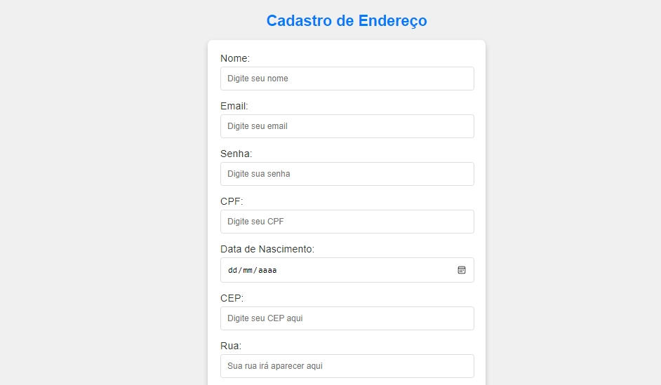

# form-CadEndereCOM

# 📍 Cadastro de Endereço

Este projeto é composto por adicionais de um ultimo prjeto ([form-CadEndereco-](https://github.com/SarahLSilva/form-CadEndereco-.git)), no caso, foi intregado o cadastro de usuário para deixar o formuário mais completo. Como individual ele permite o preenchimento automático de campos de endereço com base no CEP informado pelo usuário. Utiliza a API ViaCEP para buscar as informações necessárias.

# 💎 Principais Funções

1. limparFormulario():

2. eNumero(numero): 

3. cepValido(cep):

4. preencherFormulario(endereco): 

5. pesquisarCep(): 

6. ValidarCPF:

7. ValidarEmail:
# 🚀 Funcionalidades

Cadastro com campos: Nome, email, senha, data de nascimento e CPF

Validação de CEP: Verifica se o CEP digitado possui 8 dígitos e é composto apenas por números.

Preenchimento Automático: Preenche os campos de endereço com os dados retornados pela API.

Limpeza de Campos: Limpa os campos de endereço antes de realizar uma nova busca.

# 🟡 Resumo-da-funcionalidade

O projeto basea-se em tornar mais pratico a realização de cadstro de endeço. Qual quando é digitado o cep preenche todo os outro campos como; bairro, cidade... mantando a padronização.

# Explanção-do-codigo

1.  Inicio:
    > - 'use strict'; ativa um modo de programação que evita erros comuns, garantindo que o código seja mais seguro.

2. Função limparFormulario:

    > Limpa os campos do formulário de endereço ao definir seus valores como vazios, utilizando getElementById.

3. Validação do CEP:

    > - Função eNumero: Verifica se o valor contém apenas dígitos numéricos usando uma expressão regular.
    >
    > - Função cepValido: Confirma se o CEP possui exatamente 8 dígitos e é numérico.

4. Função preencherFormulario:

    > Recebe um objeto endereco e preenche os campos do formulário com os dados correspondentes, como logradouro e bairro.

5. Função pesquisarCep:

    >- Assíncrona: Utiliza async/await para lidar com a API.
    >
    > - Limpa o formulário e monta a URL da requisição.
    >
    > - Verifica se o CEP é válido, faz uma requisição à API viaCep, e trata a resposta convertendo-a para JSON.
    > - Se o CEP não for encontrado, exibe um alerta; caso contrário, preenche o formulário.

6. Escutador de Evento:

    > - addEventListener é usado para chamar a função pesquisarCep quando o usuário sai do campo CEP (evento focusout: O evento focusout é acionado assim que o elemento perde o foco, no caso quando o usuário sai do campo de texto).

7. Validar Cpf

    > Valida se o formato digitado no cpf é correto

8. Validar Email

    >Valida se o formato digitado no Email é correto

# ✨Atributos diferencias no codigo JavaScript

- 'async function': O async function define uma função assíncrona, que retorna um objeto AsyncFunction. Ele é utilizado em linguagens de programação como o Java Scrypit.

- 'const': A declaração const cria uma variável cujo o valor é fixo, ou seja, uma constante somente leitura. Isso não significa que o valor é imutável, apenas que a variável constante não pode ser alterada ou retribuída.

- 'await': Quando utilizamos await, o JavaScript vai aguardar até que a promessa finalize. Caso ela seja finalizada com sucesso, o valor obtido é retornado. 

- 'addres.hasOwnProperty': Resumo O método hasOwnProperty() retorna um booleano indicando se o objeto possui a propriedade especificada como uma propriedade definida no próprio objeto em questão (ao contrário de uma propriedade herdada).

# ⚙️ Como Usar

Digite o CEP no campo correspondente.
O formulário será automaticamente preenchido com as informações do endereço.

Caso o CEP não seja encontrado ou seja inválido, uma mensagem de alerta será exibida.

# 🧮 Tecnologias Utilizadas

- HTML

- CSS

- JavaScript

- API ViaCEP

- Com apoio do chat GPT

# 📝 Fontes

[ViaCEP](https://viacep.com.br/) 

>foi usado o formato JSON para o projeto

[Mozilla](https://developer.mozilla.org/pt-BR/)

>Referência para pesquisa

# 👧🏻 Participantes

- Sarah

# orientação

- Professou leonardo (da escola marista irmão acácio)